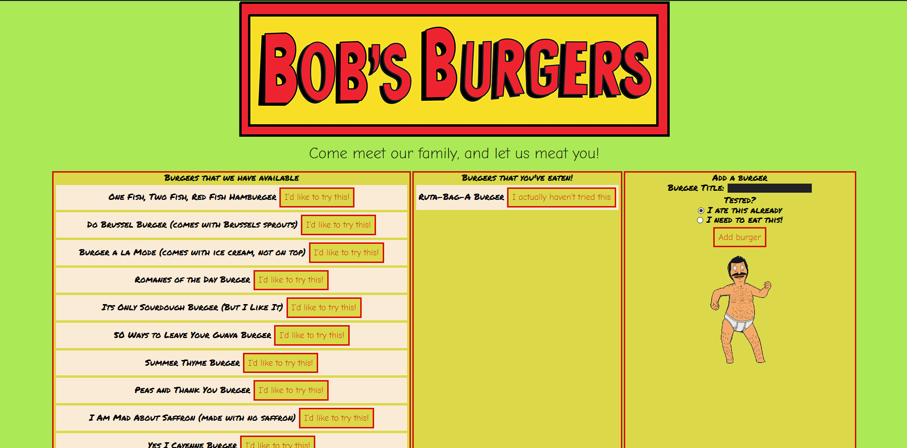

# Burgers Galore 🍔🥪👨👩‍🍳

>a good way to use Handlebars and Express

## 💻What I used💽
JavaScript, Node JS, Express, Express Handlebars

## Update Note (Mar 27, 2020)
- Added Skeleton file structure
- Added server functionality 
- Added the ability to maniputlate items in the DB
- Updated CSS

## Testing

- Testing was done with POSTMAN

## I love getting feedback and support! 🎆🎇🎈

## 📝📓💷 Preview

## Author

**🏍Dru Sanchez🏍**
*Twitter: [ImNotDrumatic](https://twitter.com/ImNotDrumatic)
*Github:  [DruSanchez](https://github.com/Drubaloo)
